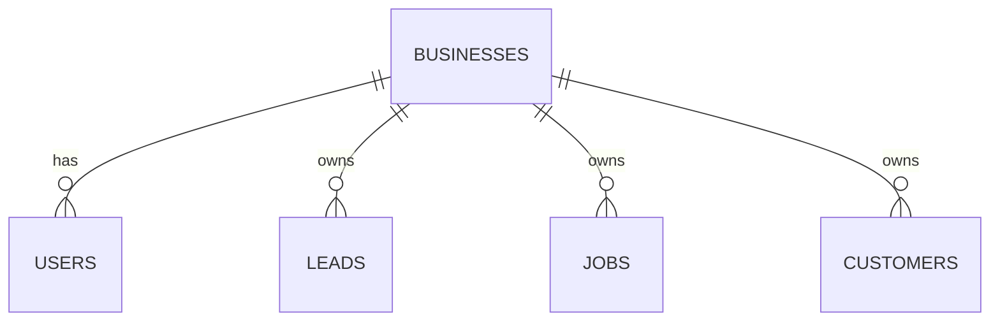
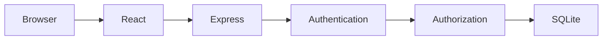

# Townside Web Client Lead & Job Dashboard

The Townside Web Client Lead & Job Dashboard is a web application designed to give service businesses a simple place to manage leads, customers, and jobs.

I built the project around a real business need for Townside Web. The goal was to create a client-facing system that keeps the most important information in one place without making the user work through a large and complicated CRM.

## Main Features

- Secure user login
- New user registration
- Password complexity requirements
- Password changes
- Business-specific accounts
- Dashboard business statistics
- Lead management
- Job management
- Customer management
- Search across leads, jobs, and customers
- Wildcard searching
- Add records
- Edit records
- Delete records
- Business data separation
- Responsive interface

## Dashboard

The dashboard gives the user a quick overview of the business, including new leads, open estimates, jobs, potential lead value, and items that may need attention.

## Search

Users can search leads, jobs, and customers by customer name, service, email, phone number, or status.

Wildcard searching is also supported. The `*` character represents multiple characters and the `?` character represents one character.

For example, searching for `*tree*` returns matching records that contain the word tree.

## Record Management

Users can add, edit, and delete leads, jobs, and customers directly from the Search page. Changes are immediately reflected in the displayed records.

## Account Management

New clients can create an account using their name, business name, email address, and password. Logged-in users can also change their password from the Account page.

## Security

The final version includes multiple security measures beyond basic password complexity:

- bcrypt password hashing
- Signed JWT authentication
- Protected backend API routes
- Server-side business access control
- Prepared SQLite statements
- Helmet HTTP security headers
- API rate limiting
- Stricter login and registration rate limiting
- CORS restrictions
- JSON request-size limits
- Environment variables for security secrets

Additional security information is available in [SECURITY.md](SECURITY.md).

## Technology Used

### Frontend

- React
- Vite
- JavaScript
- HTML
- CSS
- React Router

### Backend

- Node.js
- Express

### Database

- SQLite
- better-sqlite3

### Security

- bcrypt
- JSON Web Tokens
- Helmet
- express-rate-limit
- CORS
- dotenv

### Development Tools

- Visual Studio Code
- Git
- GitHub
- npm

## Development Process

### Phase 1

The first phase established the application structure with login, dashboard, leads, jobs, customers, navigation, an Express backend, and a SQLite database.

### Phase 2

The second phase added user registration, password requirements, password changes, search, wildcard search, account pages, and business-specific user accounts.

### Phase 3

The third phase added the ability to create, edit, and delete records directly from the Search page.

### Final Development

The final development work focused on security hardening, server-side authorization, additional demonstration data, project documentation, diagrams, testing, and cleanup.

## Project Tasks

1. Define the project scope and requirements.
2. Design the database structure.
3. Build the React user interface.
4. Build the Express backend.
5. Connect the application to SQLite.
6. Implement login and user authentication.
7. Build lead, job, and customer management.
8. Add search and wildcard search.
9. Add account registration and password management.
10. Add create, edit, and delete functionality.
11. Strengthen application security.
12. Test, document, and prepare the final project.

## Skills Demonstrated

- React application development
- Frontend interface design
- Node.js and Express development
- REST API development
- Relational database design
- SQL
- User authentication
- Password hashing
- Authorization and business data separation
- CRUD operations
- Search functionality
- Application security
- Git and GitHub version control
- Debugging and testing
- Technical documentation

## Architecture and Database Design

- [Application Architecture](docs/ARCHITECTURE.md)
- [Database Schema](docs/DATABASE_SCHEMA.md)

## Database Relationships



## Application Architecture



## Installation

Install project dependencies:

```bash
npm install
```

Create the local environment file:

```bash
cp .env.example .env
```

Generate a secure JWT secret:

```bash
openssl rand -hex 32
```

Place the generated value in `.env` as the `JWT_SECRET`.

Start the frontend and backend:

```bash
npm run dev
```

Frontend:

```text
http://localhost:5173
```

API:

```text
http://localhost:3001
```

## Demo Data

A new database automatically receives demonstration data so the application can be reviewed without manually creating records first. The demonstration business includes at least 12 lead records along with jobs and customers.

## Project Structure

```text
townside-client-dashboard/
├── docs/
├── public/
├── server/
│   ├── database-schema.sql
│   └── index.js
├── src/
│   ├── components/
│   ├── context/
│   ├── lib/
│   ├── pages/
│   ├── App.jsx
│   ├── App.css
│   └── main.jsx
├── .env.example
├── SECURITY.md
├── package.json
└── README.md
```

## Future Development

With additional development time, I would expand the project with estimates, scheduling, calendar management, notifications, reporting, more detailed analytics, additional user roles, mobile improvements, and production hosting.

The long-term goal is to continue developing the dashboard into a client portal that can be used by Townside Web service-business clients.

## Project Summary

The Townside Web Client Lead & Job Dashboard demonstrates full-stack web development using React, Node.js, Express, and SQLite. The project combines frontend design, REST API development, relational database management, authentication, authorization, CRUD operations, search, security, documentation, and Git version control. It was developed in multiple phases so each major feature could be built and tested before additional functionality was added.
