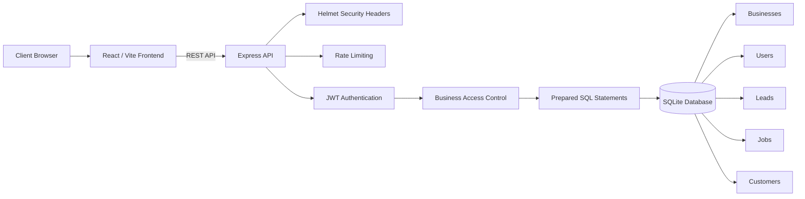

# Application Architecture

The Townside Web Client Lead & Job Dashboard uses a React frontend, an Express backend, and a SQLite database.

## Request Flow

1. A user signs in through the React frontend.
2. The Express server verifies the email and hashed password.
3. The server issues a signed authentication token.
4. Protected API requests include the authentication token.
5. The server determines the user's business from the authenticated account.
6. Database queries are limited to records belonging to that business.
7. Prepared statements are used when reading or changing database records.
