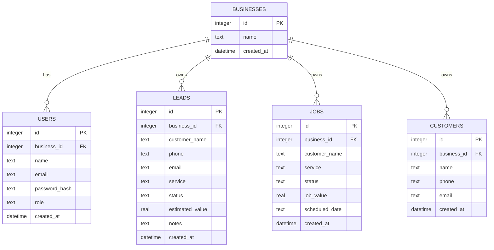

# Database Schema

The database uses the `businesses` table as the parent record for client accounts. Users, leads, jobs, and customers are connected to a business through `business_id`.

## Relationships

- One business can have multiple users.
- One business can have multiple leads.
- One business can have multiple jobs.
- One business can have multiple customers.
- `business_id` is used to keep each client's data separated.
